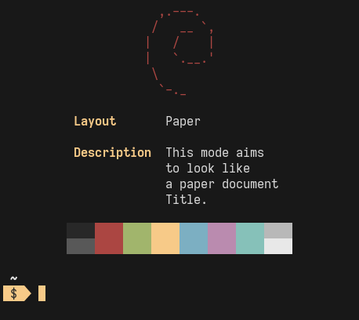
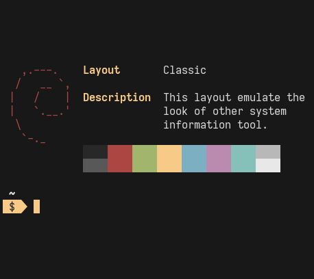

<div align="center">
<pre style="background: none !important; font-weight: bold !important;">
    ____                   
   / __ )___    __      __ 
  / __  / _/__ / /_____/ / 
 / /_/ / _/ -_) __/ __/ _ \
/_____/_/ \__/\__/\__/_//_/

</pre>
</div>

<p align="center">Dynamic fetching tool that <i>SuperB</i></p>
<p align="center">  </p>
<p align="center">   </p>

## About
**Bfetch** is a *SuperB* general-purpose fetching tool written in [`pure sh`](https://github.com/dylanaraps/pure-sh-bible) that take user commands output and change how it display dynamic with the terminal size.

### Features
- Super **minimum** with exactly than [**256** lines of `sh`](bfetch#L256) and [**no dependencies**](#dependencies) (if you don't count `sh`).
- Super **flexible**:
  - **Align/shift/change mode** contents based on terminal size.
  - **Hide** some elements if terminal is too small.
- Super **Customizable**:
  - Bfetch can **take commands output** and use it. By so, Bfetch can display **anything** you want, **however** you want.
  - And even more [**config options**](#configuration)
- Have **two mode**:

|Paper mode|Classic mode|
|-|-|
|||
|This mode aims to look like a paper document title.|This layout emulate the look of other system information tool.|

### Story
`#TODO`

## Contents
- [About](#about)
  - [Features](#features)
  - [Story](#story)
- [Contents](#contents)
- [Setup](#setup)
  - [Dependencies](#dependencies)
  - [Installation](#installation)
- [Usage](#usage)
- [Configuration](#configuration)
  - [Info element](#info-element)
  - [Art element and color element](#art-element-and-color-element)
- [Credit](#credit)

## Setup
### Dependencies
- `sh` to process

### Installation
#### Manually
- Option 1: using `curl`

```sh
curl https://raw.githubusercontent.com/NNBnh/bfetch/main/bfetch > ~/.local/bin/bfetch
chmod +x ~/.local/bin/bfetch
```

- Option 2: using `git`

```sh
git clone https://github.com/NNBnh/bfetch.git ~/.local/share/bfetch
ln -s ~/.local/share/bfetch/bfetch ~/.local/bin/bfetch
```

#### Package manager
`#TODO`

## Usage
Run Bfetch in the terminal:

```sh
bfetch
```

## Configuration
Bfetch is configured through environment variables: `export BFETCH_<SETTING>="<value>"`

|Value|Invalid|Default|Description|
|-|-|-|-|
|`BFETCH_INFO`|`<commands>`|`$XDG_CONFIG_HOME/bfetch/info` (`~/.config/bfetch/info`)|Read this commands output as infomation element (infomations)|
|`BFETCH_ART`|`<commands>`|`$XDG_CONFIG_HOME/bfetch/art` (`~/.config/bfetch/art`)|Read this commands output as art element (operating system logo)|
|`BFETCH_COLOR`|`<commands>`|`$XDG_CONFIG_HOME/bfetch/color` (`~/.config/bfetch/color`)|Read this commands output as color element (colors strip below info)|
|||||
|`BFETCH_CACHE`|`<path/to/file>`|`$XDG_CACHE_HOME/bfetch` (`~/.cache/bfetch`)|Cache's location|
|||||
|`BFETCH_CLASSIC_MODE`|`true\|false`|`false`|Make Bfetch prefer classic mode when both mode are possible|
|`BFETCH_ART_RIGHT`|`true\|false`|`false`|Render art on the right when using classic mode|
|`BFETCH_PADDING`|`0+`|`1`|Padding fetch when using classic mode|
|`BFETCH_SEPARATOR`|`0+`|`2`|Separate info and art when using classic mode|
|`BFETCH_PROMPT_HEIGHT`|`0+`|`1`|Acknowledge how high the shell prompt is and counter it so the prompt don't push the fetch out|

### Info element
Bfetch looking for and execute `$XDG_CONFIG_HOME/bfetch/info` for info element as default, you can copy [this info template](https://github.com/NNBnh/textart-collections/blob/main/fetch/info.textart) with [Fetchutils](https://github.com/lptstr/fetchutils) as a starting point and customizing.

###### [Learn about `.textart` here](https://github.com/NNBnh/textart-collections/wiki)

### Art element and color element
For art element and color element, take a look at [NNB's textart collections](https://github.com/NNBnh/textart-collections) and [other txetart resources](https://github.com/NNBnh/textart-collections#resources).

## Credit
Special thanks to:
- [**Neofetch**](https://github.com/dylanaraps/neofetch) by [Dylan](https://github.com/dylanaraps)
- [**Pfetch**](https://github.com/dylanaraps/pfetch) also by [Dylan](https://github.com/dylanaraps)
- [**Ufetch**](https://gitlab.com/jschx/ufetch) by [Jschx](https://gitlab.com/jschx)
- [**Fetchutils**](https://github.com/lptstr/fetchutils) by [LPTSTR](https://github.com/lptstr)
- [**Pure sh bible**](https://github.com/dylanaraps/pure-sh-bible) also by [Dylan](https://github.com/dylanaraps)
